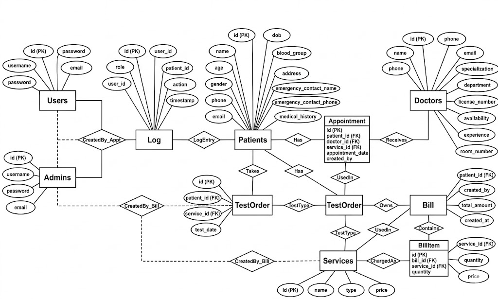

# 🏥 Pulse HMS DBMS  
### Hospital Management System using Flask + SQLite

Pulse HMS DBMS is a full-stack Hospital Management System designed to streamline hospital operations including patient management, doctor scheduling, billing, appointments, diagnostics, and administrative control. Built with **Python Flask**, **SQLite**, **HTML/CSS/JS**, this project provides a centralized solution for small to medium healthcare facilities.

> Developed as a DBMS + Web Engineering project with role-based authentication, billing automation, and patient service workflows. Based on the project structure and features in the main Flask application. :contentReference[oaicite:0]{index=0}

---

# 🚀 Features

## 🔐 Authentication & User Roles
- Root Admin access
- Admin registration/login
- Employee/User registration/login
- Secure password hashing using `Werkzeug`
- Session management with Flask

---

## 👨‍⚕️ Patient Management
- Add new patients
- View patient records
- Update patient information
- Delete patients (Admin only)
- Emergency contact details
- Medical history tracking

---

## 🩺 Doctor Management
- Add doctors
- Doctor specialization & department
- License number tracking
- Room number & availability
- Experience management

---

## 🧪 Service & Diagnostic Management
- Add hospital services
- Doctor consultation services
- Diagnostic test services
- Price management
- Service categorization (`doctor` / `test`)

---

## 📅 Appointment System
- Doctor appointment booking
- Test ordering
- Patient service desk
- Appointment tracking by:
  - Doctor
  - Patient

---

## 💳 Billing System
- Automatic bill generation
- Bill items breakdown
- Trigger-based total calculation
- Bill printing
- Billing search system

---

## 📜 Activity Logs
- User/Admin action logs
- Timestamp tracking
- Patient-specific service logs

---

# 🗄️ Database Structure

## Main Tables:
- `users`
- `admins`
- `patients`
- `doctors`
- `services`
- `appointments`
- `test_orders`
- `bills`
- `bill_items`
- `logs`

## Special Features:
- Foreign Key Constraints
- SQLite Trigger:
  - `update_bill_total`

---

# 🛠️ Tech Stack

| Technology | Purpose |
|------------|---------|
| Python | Backend |
| Flask | Web Framework |
| SQLite | Database |
| HTML5 | Frontend Structure |
| CSS3 | Styling |
| JavaScript | Interactivity |
| Werkzeug | Security |

---

# 📂 Project Structure

```bash
pulse-HMS_DBMS/
│
├── app.py
├── hospital.db
├── templates/
│   ├── login.html
│   ├── dashboard.html
│   ├── patient.html
│   ├── doctors.html
│   └── ...
│
├── assets/
│   ├── css/
│   ├── js/
│   └── images/
│
└── README.md
```
## ER Diagram

---


## ⚙️ Installation & Setup

### 1️⃣ Clone the repository
```bash
git clone https://github.com/smsmorsalin/pulse-HMS_DBMS.git
```
```bash
cd pulse-HMS_DBMS
```
### 2️⃣ Create virtual environment (optional but recommended)    # Windows
```bash
python -m venv venv
```
```bash
venv\Scripts\activate
```
### 3️⃣ Install dependencies
```bash
pip install -r requirements.txt
```
### 4️⃣ Run the application
```bash
python app.py
```

### 5️⃣ Open in browser
```bash
http://127.0.0.1:5000/
```
